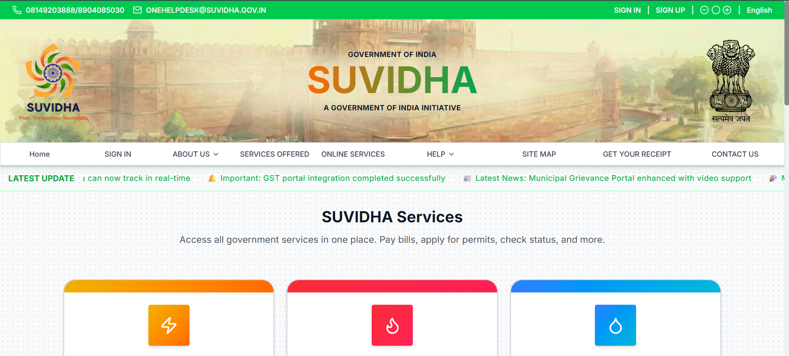
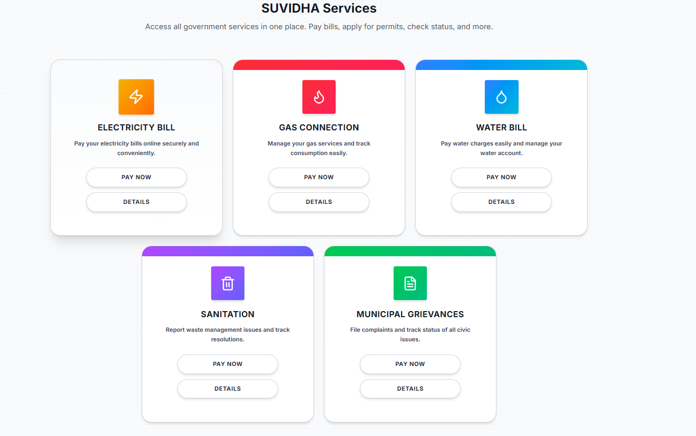
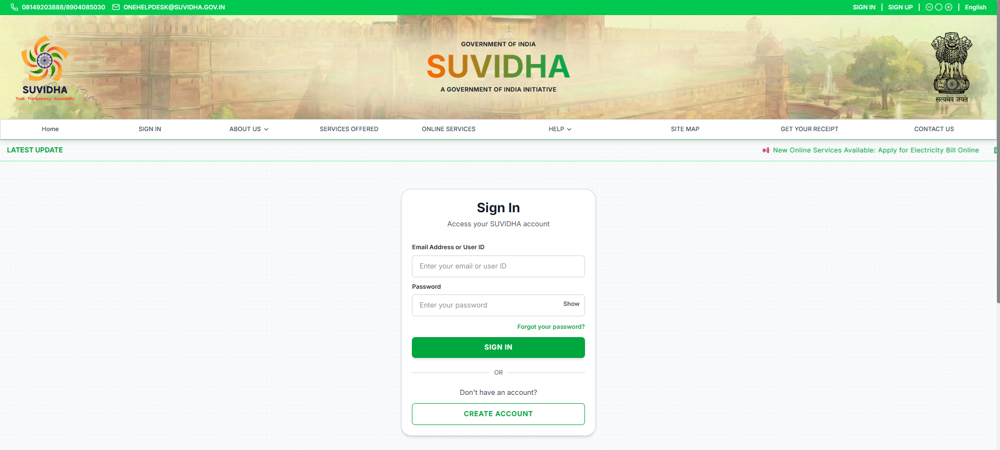
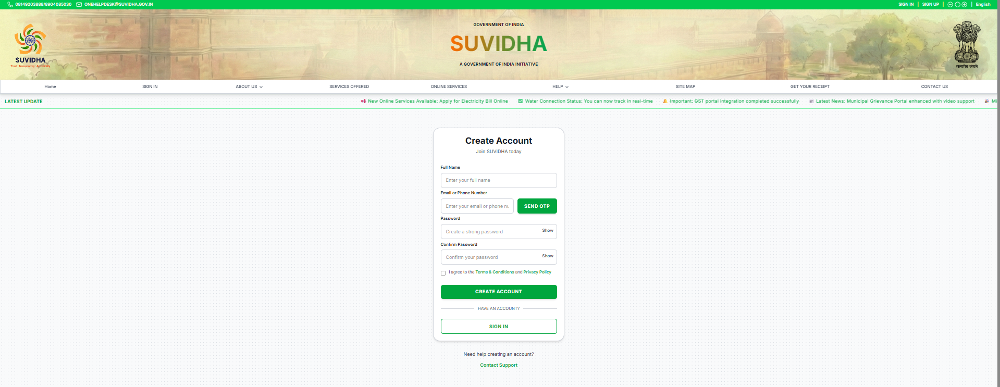

# SUVIDHA - Government Citizen Services Portal

A modern, responsive web application for delivering government services to citizens with an intuitive interface and seamless user experience.

## Table of Contents

1. [Overview](#overview)
2. [Technology Stack](#technology-stack)
3. [Features](#features)
4. [Screenshots](#screenshots)
5. [Installation](#installation)
6. [Development](#development)
7. [Building for Production](#building-for-production)
8. [Project Structure](#project-structure)
9. [Key Components](#key-components)

---

## Overview

SUVIDHA is a Government of India initiative providing citizens easy access to government services. This frontend application serves as the primary user interface for service discovery, quick access links, and service information management.

---

## Technology Stack

| Technology | Usage |
|-----------|-------|
|  | Frontend UI framework |
|  | Build tool and dev server |
|  | Styling and responsive design |
|  | Client-side routing |
|  | SVG icons |
|  | Programming language |
|  | Code quality and linting |

---

## Features

- **Comprehensive Service Modules**: Dedicated sections for Electricity, Gas, Water, Waste Management, and Municipal Services.
- **Interactive Dashboards**: Billing dashboards with payment history, consumption stats, and receipt downloads.
- **New Connection Applications**: Multi-step, user-friendly forms for applying for new utility connections.
- **Kiosk-Optimized Mode**: Specialized, accessible UI components (large touch targets, simplified forms) for public kiosk terminals.
- **Unified Design System**: Standardized "PageHeader" component and consistent theming across all service pages.
- **Multi-language Support**: Real-time language switching with Context API.
- **Responsive Design**: Fully responsive layout optimized for mobile, tablet, and desktop.
- **Role-Based Access Control**: Distinct portals for Citizens, Department Heads, and Super Admins.
- **Government Branding**: Official emblem, localized headers, and trust indicators.
- **Smooth Animations**: Animated news ticker and page transitions.
- Trust indicators and verification marks

---

## Access & Credentials

Use the following credentials to access the different portals of the application.

### 1. Citizen Portal (User)
*   **URL**: `/signin`
*   **Email**: `test@suvidha.gov.in`
*   **Password**: `test123`
*   **Role**: Standard user access to apply for services, pay bills, and view history.

### 2. Department Admin Portal
*   **URL**: `/admin/login`
*   **Email**: `admin@suvidha.gov.in`
*   **Password**: `admin123`
*   **Role**: Department Head access to manage specific utility services (Electricity, Gas, Water).

### 3. Super Admin Portal
*   **URL**: `/super-admin/login`
*   **Email**: `super@suvidha.gov.in`
*   **Password**: `super123`
*   **Role**: System-wide access to oversee all departments, users, and platform settings.

---

## Screenshots

### Home Page


### Services Page


### Sign In page


### Sign Up Page


---

## Installation

### Prerequisites
- Node.js (v18 or higher)
- npm or yarn

### Setup

```bash
# Clone repository
git clone <repository-url>
cd client

# Install dependencies
npm install

# Verify installation
npm list
```

---

## Development

Start the development server with hot reload:

```bash
npm run dev
```

Access the application at `http://localhost:5173`

---

## Building for Production

Create an optimized production build:

```bash
npm run build
```

Preview the production build:

```bash
npm run preview
```

---

## Project Structure

```
src/
├── components/          # Reusable UI components
├── pages/              # Page components (Home, Services, Auth)
├── context/            # Language context and state management
├── hooks/              # Custom React hooks
├── utils/              # Utility functions and helpers
├── assets/             # Images (emblem, logo, banner)
├── App.jsx             # Main application component
└── main.jsx            # Entry point
```

---

## Key Components

- **TopBar**: Top-level navigation and info bar
- **HeroSection**: Government header with branding
- **TickerBanner**: Animated news ticker with announcements
- **ServiceCard**: Individual service display with expandable details
- **NavBar**: Navigation menu with language switcher
- **LanguageSwitcher**: Multi-language support
- **Footer**: Application footer with links
- **QuickActionCard**: Quick access service shortcuts
- **TrustIndicators**: Visual section establishing trust
- **ProgressIndicator**: Visual indicators for multi-step processes
- **ServiceStatus**: Status indicators for services

---

## How We Used Technologies

**React**: Built interactive UI components with hooks for state management and context for language switching.

**Vite**: Provides fast development server with hot module replacement for quick iterations.

**Tailwind CSS**: Used utility-first CSS classes for responsive design and component styling throughout the application.

**React Router**: Manages client-side routing between different pages (Home, Services, Authentication).

**Lucide React**: Provides consistent SVG icons for services and UI elements.

**JavaScript ES6+**: Utilized modern JavaScript features like arrow functions, destructuring, and async/await.

**ESLint**: Ensures code quality and consistency across the codebase.

---

## Code Quality

Run linting before committing:

```bash
npm run lint
```

---

## Browser Support

- Chrome (Latest)
- Firefox (Latest)
- Safari (Latest)
- Edge (Latest)

---

## License

Part of the Government of India SUVIDHA initiative.

---

**Version**: 1.0.0  
**Last Updated**: January 2026